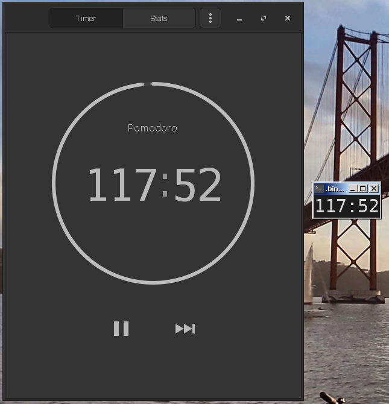

# gnome-pomodoro-listener
Show [gnome-pomodoro](https://gnomepomodoro.org/) progress in a terminal window (mini window)

As gnome-pomodoro app does not have a mini-window feature, it's not possible to keep it on top of the screen. This may not be an issue for the gnome-panel extension users, but it is less than ideal for users outside of GNOME.  
This Python script displays the remaining time in a terminal window based on the same D-Bus & GSettings mechanism used to communicate with the gnome-panel extension, as a workaround.  

It requires dbus-python and Python bindings for Gio and Glib.

